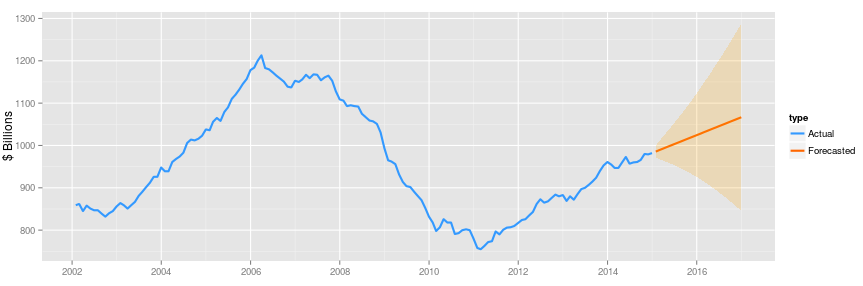

## The US Construction Spending Tracker Overview

US Census provides monthly estimates of the total dollar value of construction work done in the U.S. 

This Web application pulls the latest data from the US Census website and automatically updates the charts. 

It also provides forecasted values of overall spending using ARIMA function based on the subset of data selected by user. 

You can access the application here: http://rkim.shinyapps.io/constApp/

--- .class #id 

## About the Data

It contsains monthly data from 01/31/2002 to 01/31/2015

There are 3 types of spending sources

1. Total: Sum of Private and Public sector spending
2. Private: Private sector spending on Residential & Non-Residential projects
3. Pulbic: Feberal & State government spending on various publich projects

--- .class #id 

## Plot Examle 1: Overall Spending - Total

    

* The blue line represents the actual data from the US census, and the orange line is the mean forecasted and 80% confidnece intervals
* The forecasted value gets automatically updated when the user changes the actual peiriod to display and 
also the number of months to forecast on the side bar

--- .class #id 

## Plot Examle 2: Non-Residential Details by Type - Total

    

* The above chart shows the break down of non-residential spendings by project type
* The chart also interactivly changes when user changes the spending sources and/or years to display

